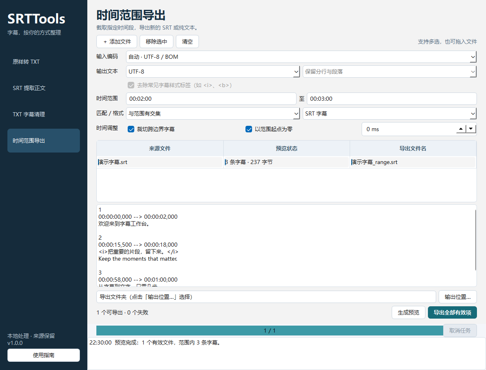

# SRTTools

**把字幕变成文字，也把需要的片段单独留下。**

一个面向 Windows 的中文桌面字幕工具：原样转 TXT、提取正文、清理 TXT 中的字幕信息，以及按时间范围导出 SRT / TXT。支持批量预览与导出，全程本地处理，来源文件始终保留。



## 选对功能

| 你的需求 | 使用页面 | 得到什么 |
| --- | --- | --- |
| SRT 改成 TXT，内容一点不变 | 原样转 TXT | 保留原始字节、编码、换行、序号和时间轴的 TXT |
| SRT 只要字幕正文 | SRT 提取正文 | 去掉序号与时间轴，保留多行、中文和双语内容 |
| 已有 TXT 里还残留 SRT 信息 | TXT 字幕清理 | 删除可识别的时间轴及其结构序号，保留正文数字 |
| 只导出 2 分钟到 3 分钟的字幕 | 时间范围导出 | 新 SRT 或纯文本 TXT，可从零开始计时 |

还包括拖放、多文件批处理、输入编码选择、UTF-8 / UTF-16 输出、文本排版、常见字幕标签清理、毫秒级时间偏移、冲突文件名自动编号，以及最新记录在顶部的操作日志。

## 开始使用

便携版：解压 `SRTTools.zip`，双击根目录的 `SRTTools.exe`，无需安装 Python。保留旁边的 `_internal` 文件夹。

1. 选择左侧功能，添加或拖入字幕文件。
2. 设置编码、时间范围或正文排版，点击 **生成预览**。
3. 选择表格中的文件检查输出；错误原因在状态列和预览区中显示。
4. 选择输出文件夹，点击 **导出全部有效项**。

输出始终是新文件，例如 `课程_text.txt`、`课程_range.srt`；同名时生成 `课程 (2)_text.txt`。预览不写文件，导出前会检查来源是否已改变。批处理中失败或取消的文件会明确报告，已成功导出的文件保留。

仓库内提供可直接体验的 [示例字幕](examples/示例字幕.srt)。便携包由源码构建生成在本地 `dist/`，二进制不提交进 Git。完整说明见 [使用指南](docs/使用指南.md)。

## 时间范围怎么选

例如从完整视频中提取 **第 2 分钟到第 3 分钟**：开始填 `00:02:00`，结束填 `00:03:00`。也可以填秒数 `120` 和 `180`；单独输入 `2`、`3` 表示第 2 秒到第 3 秒。

- 默认选择与范围有交集的字幕，并把跨边界的开始/结束时间裁切到范围内。
- 可改为“整条完全在范围内”或“开始时间在范围内”。范围为左闭右开：在结束点才开始的字幕不纳入。
- 勾选“以范围起点为零”，导出的 SRT 适合对应的截取视频；不勾选则保留原视频时间位置。
- 时间偏移在选取、裁切和归零之后应用。会产生负时间的组合直接报错，避免悄悄丢字幕。
- 新 SRT 的序号从 1 开始；保留正文、样式和时间轴附加设置。字幕有重叠或原始顺序异常时提示，不自动重排。

## 源码运行与命令行

使用 Windows、Python 3.14。依赖版本固定在 requirements 文件中。

```powershell
python -m venv .venv
.\.venv\Scripts\python.exe -m pip install -r requirements-dev.txt
.\.venv\Scripts\python.exe run_srttools.py
```

命令行与界面共用处理内核，不启动 Qt 窗口。不指定 `-o` 时只预览；输出目录需已存在。

```powershell
# 首次使用示例时创建输出目录
New-Item -ItemType Directory -Force .\output
# 原样转 TXT
.\.venv\Scripts\python.exe -m srttools.cli raw .\examples\示例字幕.srt -o .\output
# SRT 提取正文，清理样式，每条字幕一行
.\.venv\Scripts\python.exe -m srttools.cli text .\examples\示例字幕.srt --strip-tags --layout lines -o .\output
# 已转换 TXT 再清理
.\.venv\Scripts\python.exe -m srttools.cli clean .\output\示例字幕_original.txt -o .\output
# 2–3 分钟，新 SRT 从零开始
.\.venv\Scripts\python.exe -m srttools.cli range .\examples\示例字幕.srt --start 02:00 --end 03:00 --rebase -o .\output
# 同一范围导出纯文本
.\.venv\Scripts\python.exe -m srttools.cli range .\examples\示例字幕.srt --start 120 --end 180 --format txt -o .\output
```

`--help` 列出编码、范围匹配、裁切、偏移和排版选项。多个输入路径可以连续传入；任意处理失败时退出码为 1。

## 工程结构

沿用 ObManage 的分层思路：中文桌面壳、独立业务引擎、隔离测试、可重复打包与可审计工程记忆。

```text
SRTTools/
├── run_srttools.py       # GUI 入口
├── srttools/
│   ├── app.py / ui.py    # 静态四页导航与受控后台线程
│   ├── subtitles.py     # 字幕解析、清理、范围与时间计算（无 Qt）
│   ├── service.py       # 只读预览、来源复核、原子新文件导出
│   ├── cli.py           # 无界面批处理入口
│   └── smoke.py         # 演示数据端到端验收
├── tests/               # 编码、内容、边界、失败与 CLI 回归
├── tools/               # 图标与便携包构建
├── docs/ / examples/    # 使用指南、截图与演示字幕
├── wiki_memory/         # 当前状态、ADR、知识、日志、模板和检查工具
├── AGENTS.md            # 统一协作约定
└── AGENT.md             # 指向统一约定的兼容入口
```

开发前读 [AGENT.md](AGENT.md)，当前项目事实见 [工程记忆](wiki_memory/README.md)。

```powershell
.\.venv\Scripts\python.exe -m pytest -q
.\.venv\Scripts\python.exe wiki_memory\工具\memory_lint.py index
.\.venv\Scripts\python.exe wiki_memory\工具\memory_lint.py check
.\.venv\Scripts\python.exe tools\build.py
.\dist\SRTTools\SRTTools.exe --smoke-test .\artifacts\frozen\workspace.png
```

构建生成 `dist/SRTTools/SRTTools.exe` 与 `dist/SRTTools.zip`，ZIP 根层直接包含 EXE、`_internal`、使用说明和许可证。Windows CI 会执行回归、记忆检查、构建和冻结包验收。

## 支持范围

支持标准 SRT，兼容带 BOM、CRLF/LF、逗号/点号毫秒、无序号字幕块、多行正文与时间轴附加设置。缺少块分隔、错误时间或空正文会报告错误。TXT 清理保留非字幕段落，不按“全是数字就删除”的规则处理。

自动编码识别只接受 UTF-8 和有 BOM 的 UTF-16；GB18030、Big5、Windows-1252 需要手动选择。原样转换即使无法解码预览，也会保留全部原始字节。每文件上限 64 MiB，每批输入上限 256 MiB；界面只展示前 50,000 字符，导出保留全文。

不包含音视频识别、翻译、语义改写或 ASS/VTT 转换。取消在文件处理边界生效；不会撤销已经导出的新文件。第三方组件信息见 [THIRD_PARTY_NOTICES.md](THIRD_PARTY_NOTICES.md)。
